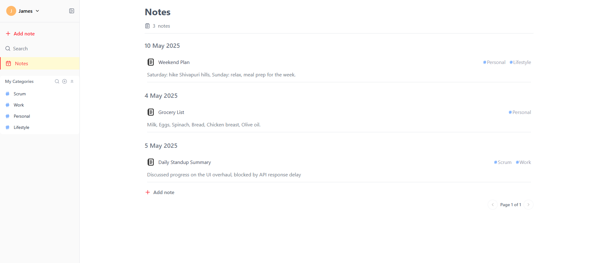

# Note-Taking App

This is a full-stack note-taking application with a **frontend** built using React and a **backend** powered by Node.js and Express. The app allows users to create, edit, and delete notes with categories and tags. It also includes user authentication and a responsive design.



---

## Features

- User authentication
- Create, edit, and delete notes
- Responsive design
- RESTful API for backend

---

## Setup Instructions

### 1. Clone the Repository

```bash
git clone git@github.com:Sabnit/note-taking-app.git
cd note-taking-app
```

### 2. Setup Backend

1. Navigate to the backend directory:

   ```bash
   cd backend
   ```

2. Install dependencies:

   ```bash
   npm install
   ```

3. Create a `.env` file in the `backend` directory using `.env.exmaple` and configure accordingly:

Use "https://console.prisma.io/" to create a new database and get the connection string.

4. Start the backend server:

   ```bash
   npm start
   ```

   The backend will run on `http://localhost:5000`.

---

### 3. Setup Frontend

1. Navigate to the frontend directory:

   ```bash
   cd ../frontend
   ```

2. Install dependencies:

   ```bash
   npm install
   ```

3. Start the development server:

   ```bash
   npm start
   ```

   The frontend will run on `http://localhost:3000`.

---

## Scripts

### Backend

- `npm start`: Start the backend server
- `npm run dev`: Start the backend server in development mode

### Frontend

- `npm start`: Start the React development server
- `npm run build`: Build the React app for production

---

## Technologies Used

### Frontend

- React
- Axios
- React Router
- Tanstack react-query
- Tailwind CSS
- React-toastify

### Backend

- Node.js
- Express.js
- Primsa-(Prostgres)
- JWT

---

## Checklist

- [x] **Notes**
  - [x] Create note
  - [x] Edit note
  - [x] Delete note
  - [x] View list of notes
  - [x] View a single note
- [x] **Categories**
  - [x] Add multiple categories to a note.
  - [x] Filter notes based on category.
- [x] **Authentication/Authorization**
  - [x] Signup
  - [x] Login
- [x] **Tech stack needed:**

  - [x] FE: React
  - [x] BE: Node
  - [x] Database: MySQL [Note: used PostgreSQL with Prisma ORM]

- Engineering Requirements

- [x] UI should be clean and responsive
- [x] Implement frontend and backend validations to ensure data integrity
- [x] Display proper error messages for validation and backend errors
- [x] Graceful error handling throughout the application
- [x] Secure authentication mechanism
- [x] Authorization to protect/restrict pages and APIs
- [x] Protected pages/APIs must be secure
- [x] APIs should follow RESTful conventions
- [x] Pagination and filters should be server-side
- [x] Consider database design and normalization (documentation optional)

- Preferred Expectations (Nice to Have)

  - [x] Reusable frontend components (e.g., buttons, tables, navbars, dialogs)
  - [ ] Include unit tests (any additional test types are preferred)
  - [x] Backend logging implementation
  - [ ] API documentation using tools like Swagger
  - [x] Use migration tools to track database changes
  - [ ] Additional authentication features (e.g., 2FA, account verification via email/phone)

- [x] Additional Features to Consider
  - [ ] Search notes by title or content
  - [ ] Sorting options for notes (e.g., by creation date, last modified, alphabetical)
